pyramid_debugtoolbar
====================

.. _overview:

Overview
--------

:mod:`pyramid_debugtoolbar` provides a useful debug toolbar while you're
developing a :term:`Pyramid` application.

The toolbar is a blatant rip-off of Michael van Tellingen's
``flask-debugtoolbar`` (which itself was derived from Rob Hudson's
``django-debugtoolbar``).  It also includes a lightly sanded down version of
the Werkzeug debugger code by Armin Ronacher and team.

Installation
------------

Install using setuptools, e.g. (within a virtualenv)::

  $ easy_install pyramid_debugtoolbar

Setup
-----

Once the :mod:`pyramid_debugtoolbar` is installed, you must use the
``config.include`` mechanism to include it into your Pyramid project's
configuration:

.. code-block:: python

   config = Configurator(.....)
   config.include('pyramid_debugtoolbar')

Alternately, you may activate the toolbar by changing your application's
``.ini`` file by adding it to the ``pyramid.includes`` list:

.. code-block:: ini

   pyramid.includes = pyramid_debugtoolbar

.. warning:: The debug toolbar should never be enabled in a production
   environment or on a machine with its Pyramid HTTP port exposed directly to
   the internet; it allows arbitrary code execution from only semi-trusted
   sources when configured poorly.

Usage
-----

Once Pyramid is restarted, the toolbar will be available to inspect requests
and responses by the application by visiting the ``/_debug_toolbar/`` URL
(note the trailing slash). For example, if your application is available at
``http://localhost:6543/`` then you may visit
``http://localhost:6543/_debug_toolbar/`` to inspect the requests.

For any HTML responses generated by the application, a link to the toolbar
for the current page will be available in the upper right corner, provided
the response contains a closing ``</body>`` tag.

Debugging Unhandled Exceptions
~~~~~~~~~~~~~~~~~~~~~~~~~~~~~~

If an exception is unhandled by the Pyramid application, the toolbar will
catch it and render an HTML page with a traceback and an interactive debugger
that can be used to dive into the stack and execute arbitrary Python
expressions to inspect the state of the system.

A URL leading to a debugging page for each exception raised by your
application will additionally be logged to the console.

Settings
~~~~~~~~

Settings can be used to control the operation of the toolbar. These settings
are typically specified in the Pyramid "app" section of the Pyramid ``.ini``
file.

``debugtoolbar.hosts``

  If the request's ``REMOTE_ADDR`` is not in this list,
  the toolbar will not be displayed and the exception handler will not be
  active.  Default value is ``['127.0.0.1', '::1']``.  Note that each of the
  values in the list can be a hostmask, e.g., ``192.168.1.0/24``.

  This should be a list if setup is done in Python or, if defined in a Paste
  ``.ini`` file, a single-line list of IP addresses/hostmasks separated by
  spaces.  For example::

     debugtoolbar.hosts = 192.168.1.1 192.168.2.0/24

  To enable access from any host, use the hostmask ``0.0.0.0/0``.

``debugtoolbar.enabled``

  ``true`` if the toolbar is enabled; ``false`` if the toolbar is disabled.
  Default is ``true``.  This disables both the exception handler and the
  toolbar overlay.

``debugtoolbar.intercept_exc``

  This setting can have one of three values: ``display``, ``debug`` or
  ``false``.  Default is ``debug``.  If this value is ``display``, the toolbar
  will display a "pretty" traceback page which allows source viewing and
  when an exception happens.  If this value is ``debug``, the "pretty"
  traceback page will be shown, but it will also contain interactive
  debugging controls which allow you to evaluate arbitrary Python
  expressions in the context of a portion of the traceback, which is useful
  when attempting to track down the cause of the exception. If this value is
  ``false``, the "pretty" traceback will be disabled and all exceptions will
  be raised to the caller of the Pyramid application (usually a WSGI
  server).  Default is ``debug``.  This setting differs from
  ``debugtoolbar.enabled``: it only enables or disables the exception
  handler.  Note that, for backwards compatibility purposes, the value
  ``true`` provided to this setting is interpreted as ``debug``.

``debugtoolbar.eval_exc``

  ``true`` if real-time exception debugging is enabled when
  ``intercept_exc`` is true; ``false`` if real-time exception debugging is
  disabled.  Default is ``true``.  This differs from
  ``debugtoolbar.intercept_exc``: it only controls whether the pretty
  exception rendering displays real-time in-browser debugging controls.  The
  real-time in-browser debugging controls allow you to evaluate arbitrary
  Python expresssions in the context of a stack frame via a browser control.

``debugtoolbar.show_on_exc_only``

  Default is ``false``. If set to ``true`` the debugtoolbar will only be
  injected into the response in case a exception is raised. If the response is
  processed without exception, the returned html code is not changed by the
  debugtoolbar at all. This option allows the developer to use the toolbar for
  debugging purposes without interfering with successful responses.

  Inspection of requests is still possible by visiting the toolbar manually.

``debugtoolbar.intercept_redirects``

  ``true`` if the redirection handler is enabled; ``false`` if the handler
  is disabled.  Default is ``false``.  This differs from
  ``debugtoolbar.enabled``: it only enables or disables the redirection
  handler.

``debugtoolbar.panels``

  A list of dotted Python global names to panel classes.  Defaults to a
  list of all panel types known by :mod:`pyramid_debugtoolbar`, as
  documented in :ref:`pyramid_debugtoolbar_api`.  If this is spelled in an
  ``.ini`` file, it should be a space- or newline-separated sequence of
  dotted Python names.  For example::

    debugtoolbar.panels =
        pyramid_debugtoolbar.panels.versions.VersionDebugPanel
        pyramid_debugtoolbar.panels.settings.SettingsDebugPanel
        pyramid_debugtoolbar.panels.headers.HeaderDebugPanel
        pyramid_debugtoolbar.panels.request_vars.RequestVarsDebugPanel
        pyramid_debugtoolbar.panels.renderings.RenderingsDebugPanel
        pyramid_debugtoolbar.panels.logger.LoggingPanel
        pyramid_debugtoolbar.panels.performance.PerformanceDebugPanel
        pyramid_debugtoolbar.panels.routes.RoutesDebugPanel
        pyramid_debugtoolbar.panels.sqla.SQLADebugPanel
        pyramid_debugtoolbar.panels.tweens.TweensDebugPanel
        pyramid_debugtoolbar.panels.introspection.IntrospectionDebugPanel

``debugtoolbar.extra_panels``

  A list of dotted Python global names to panel classes. This list of panels
  is appended to the panels defined in ``debugtoolbar.panels``. If you'd like
  to maintain the default panels and add on some extra ones, this should help::

    debugtoolbar.extra_panels =
        myapp.debugtoolbar.panels.MyCustomPanel

``debugtoolbar.button_style``

  Any inline css styles you want to apply to the toolbar button. This
  will override the default style (``top:30px;``) set by ``toolbar.css``. If,
  for example, you want the toolbar button to show up at the bottom off the
  screen, just set ``debugtoolbar.button_style`` to ``top:auto;bottom:30px;``.
  If your browser supports the zoom property, you can even control the
  magnification level of the toolbar button, e.g., ``zoom:50%;``.

``debugtoolbar.exclude_prefixes``

  The debug toolbar won't be shown and no data will be recorded if the
  ``PATH_INFO`` variable starts with any of the prefixes listed in this setting.
  If configuration is done via an ``.ini`` file, the prefixes should be separated
  by carriage returns. For example::

    debugtoolbar.exclude_prefixes =
        /settings
        /static

  If configuration is done via Python, the setting should be a list.  This
  setting was added in debugtoolbar version 1.0.4.

``debugtoolbar.active_panels``

  A space-separated list of panel names (see
  :attr:`pyramid_debugtoolbar.panels.DebugPanel.name`). This list of panels
  will have their :attr:`pyramid_debugtoolbar.panels.DebugPanel.is_active`
  state set to ``True`` always. For example::

    debugtoolbar.active_panels = performance

  This will set the listed panels to always be active. Instead, in order
  to enable per-request activation see :ref:`activating_panels`.

``debugtoolbar.max_request_history``

  The debug toolbar works by storing the original request and it's associated
  data in memory, and making this data available to subsequent requests.  By
  default, the toolbar maintains a history of the last 100 requests made to the
  application. By setting ``debugtoolbar.max_request_history``, one can override
  the default of 100 and set it to a different number.

``debugtoolbar.max_visible_requests``

  The number of requests shown in the sidebar.  The default is 10.

``debugtoolbar.includes``

  The debugtoolbar will use Pyramid's default
  :meth:`pyramid.config.Configurator.include` mechanism to extend the toolbar's
  internal Pyramid application with custom logic. This is a good spot to affect
  static assets used by the toolbar, or add custom urls.

Useful settings for debugging panels/debugtoolbar
`````````````````````````````````````````````````

When developing custom panels for an application, the following settings may
be used to influence how debugtoolbar itself behaves and what information it
logs.

``debugtoolbar.debug_notfound``

  Print view-related ``NotFound`` debug messages to ``stderr`` when this
  value is ``true``.

``debugtoolbar.debug_routematch``

  Print debugging messages related to URL dispatch route matching when this
  value is ``true``.

``debugtoolbar.reload_templates``

  When this value is ``true``, templates are automatically reloaded whenever
  they are modified without restarting the application, so you can see changes
  to templates take effect immediately during development. This flag is
  meaningful to Chameleon and Mako templates, as well as most third-party
  template rendering extensions.

``debugtoolbar.reload_resources``

  Alias for ``debugtoolbar.reload_assets``.


``debugtoolbar.reload_assets``

  Don't cache any asset file data when this value is ``true``.

``debugtoolbar.prevent_http_cache``

  Prevent the ``http_cache`` view configuration argument from having any
  effect globally in this process when this value is ``true``. No HTTP
  caching-related response headers will be set by the Pyramid ``http_cache``
  view configuration feature when this is ``true``.


Custom authorization
~~~~~~~~~~~~~~~~~~~~

Since version 1.0.5 ``pyramid_debugtoolbar`` offers custom
authorization mechanism to control toolbar feature on per-request basis.
Using the ``config.set_debugtoolbar_request_authorization(callback)``
directive, you can specify your own function to control whether toolbar
functionality is enabled or not.

.. note::

   Custom authorization is performed **after** a successful IP address
   check when the ``debugtoolbar.hosts`` settings option is used.

.. note::

   Custom authorization does not have an effect on the
   ``pyramid_debugtoolbar`` static route and ``/_debug_toolbar/static/*``
   contents will still be accessible.

.. code-block:: python

   from pyramid.security import authenticated_userid
   from pyramid.settings import aslist

   def admin_only_debugtoolbar(request):
       """
       Enable toolbar for administrators only.
       Returns True when it should be enabled.
       """
       admins = aslist(request.registry.settings.get('admins', ''))
       userid = authenticated_userid(request)
       toolbar_enabled = userid and userid in admins
       return toolbar_enabled

   config = Configurator(.....)
   config.include('pyramid_debugtoolbar')
   config.set_debugtoolbar_request_authorization(admin_only_debugtoolbar)

.. _activating_panels:

Activating Panels
~~~~~~~~~~~~~~~~~

Most panels do not support any extra active features and need not be
explicitly activated. However, some panels support an optional
:attr:`~pyramid_debugtoolbar.panel.DebugPanel.is_active` state in which they
will do some extra work. For example, the
:class:`~pyramid_debugtoolbar.panels.performance.PerformanceDebugPanel``
will not do profiling of your requests unless it has been activated.

This activation can be controlled on a per-request basis by setting the
``pdtb_active`` cookie to a comma-separated list of panel names.
For example::

  Cookie: pdtb_active=performance,foo,bar

A panel name is defined by the
:attr:`~pyramid_debugtoolbar.panels.DebugPanel.name` attribute of each
debug panel.

The Toolbar
-----------

When you include the toolbar in your application, a floating Pyramid logo
will appear on the upper right over your application's HTML:

.. image:: toolbar-closed.png

If you click on the Pyramid logo, a new target window will open with your
current request highlighted and all of your configured panels loaded.

.. image:: toolbar-open.png

Toolbar Panels
--------------

These are the default toolbar panels:

Versions
~~~~~~~~

Displays versions of all installed Python software as well as the Python
version and platform itself.

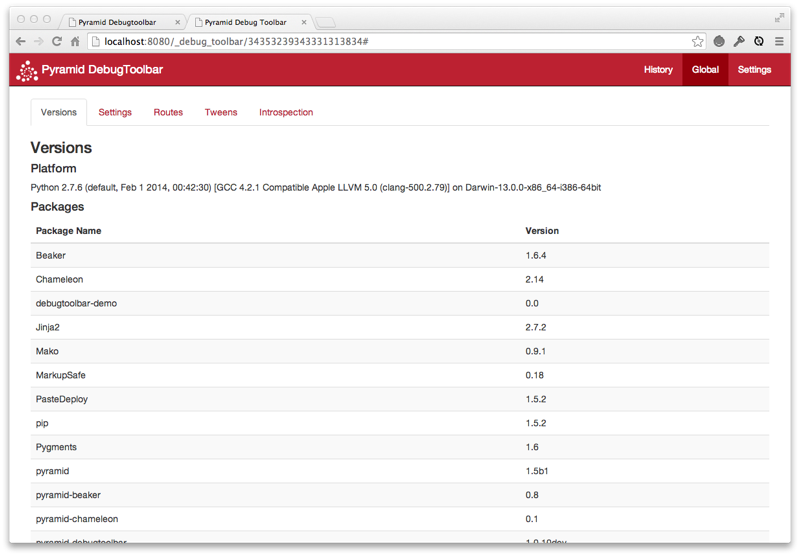

Settings
~~~~~~~~

Displays Pyramid deployment settings, i.e., ``registry.settings``.

.. image:: settings.png

HTTP Headers
~~~~~~~~~~~~

Displays HTTP request and response headers for the current page.

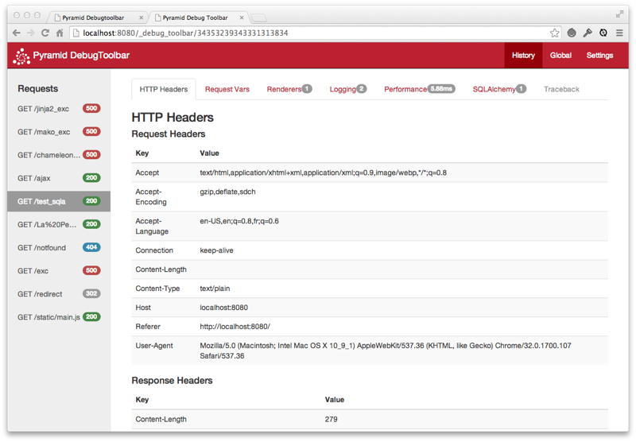

Request Vars
~~~~~~~~~~~~

Displays objects attached to the request of the current page and the WSGI
environment.

.. image:: requestvars.png

Renderings
~~~~~~~~~~

Displays the renderings performed by Pyramid for the current page.

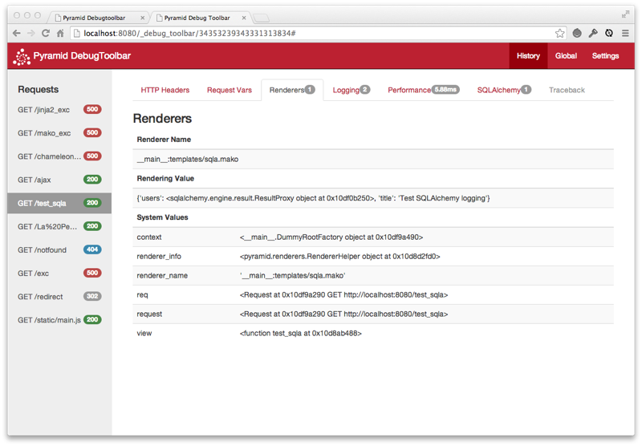

Logging
~~~~~~~

Displays messages logged by the current page.

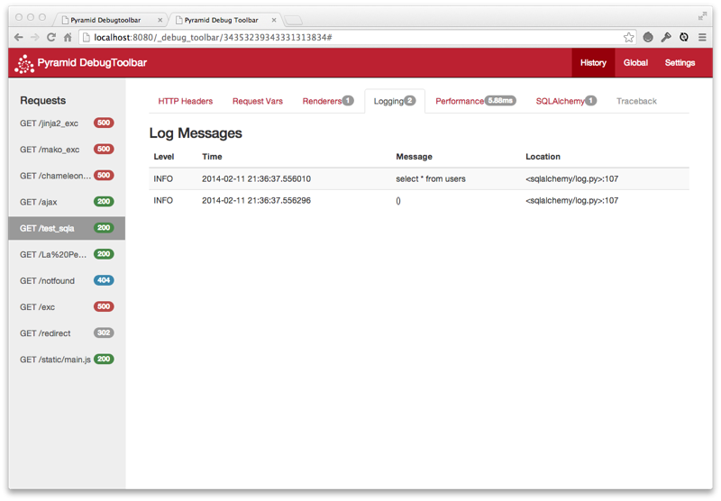

Performance
~~~~~~~~~~~

Displays timing information, and, if enabled, Python profiling information
for the current page.  When it is red, only timing will be done and
no profiling information.

.. note::

   An internal profiler can be enabled through the "performance" checkmark
   in the "Settings" tab in the navigation bar. When the checkbox is green,
   the request will be profiled and profiling information will be gathered and
   displayed on the "Performance" panel output.

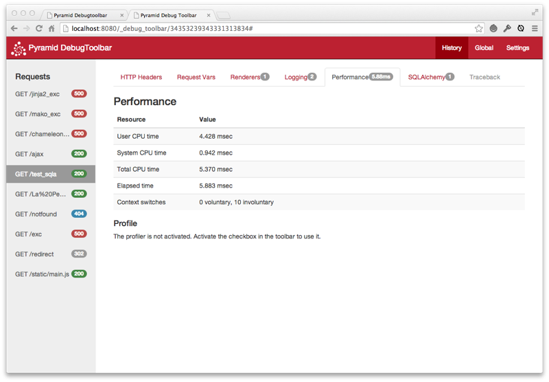

Routes
~~~~~~

Displays the routes currently configured in your application.

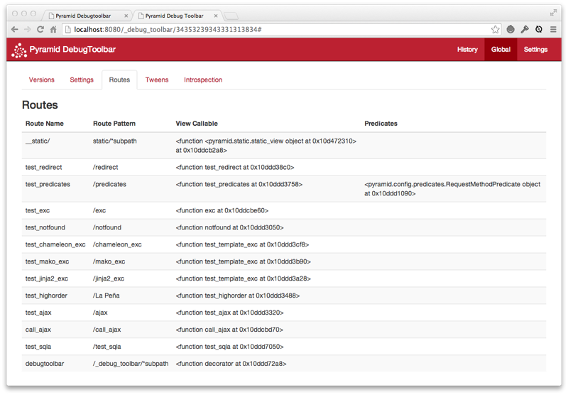

Tweens
~~~~~~

Displays the tween chain for your application, and whether they were defined
explicitly or implicitly.

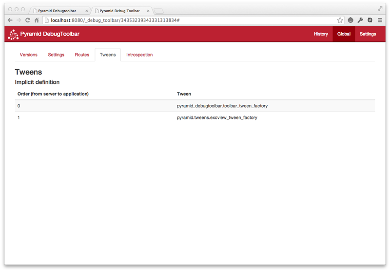

SQLAlchemy
~~~~~~~~~~

Displays SQL queries made by SQLAlchemy by the current page along with timing
information.

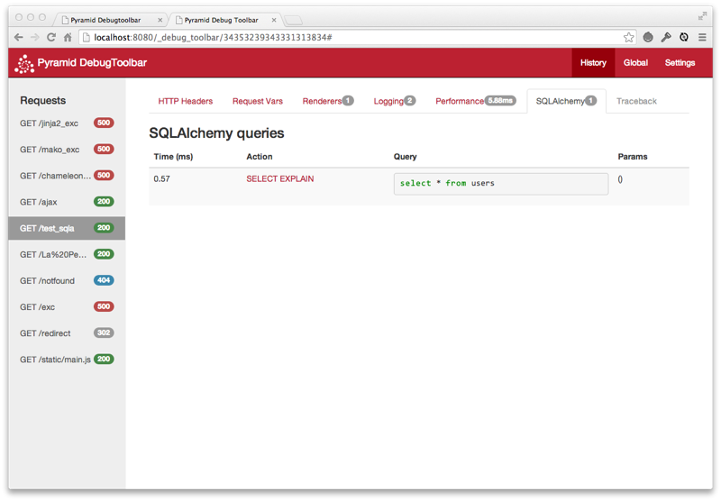

Provides the ability to re-run the query using the "SELECT" link.

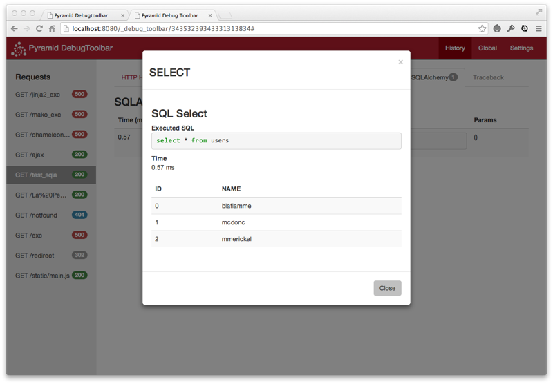

Provides the ability to get more detail about the query using the "EXPLAIN"
link.

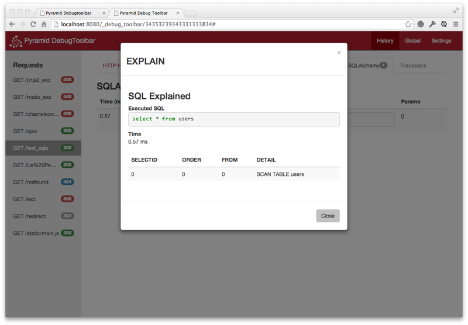

Introspection
~~~~~~~~~~~~~

Displays a rendering of the data available in Pyramid's configuration
introspection system (available in Pyramid 1.3+ only).

.. image:: introspection.png

Exception Handling
------------------

When an exception is raised and the ``debugtoolbar.intercept_exc`` setting is
``display`` or ``debug``, Pyramid presents a pretty traceback page.  If the
setting value is ``debug``, you will be able to examine locals in each frame
in the traceback and execute code in the context of each frame.  Read the
instructions on the exception page for more information.

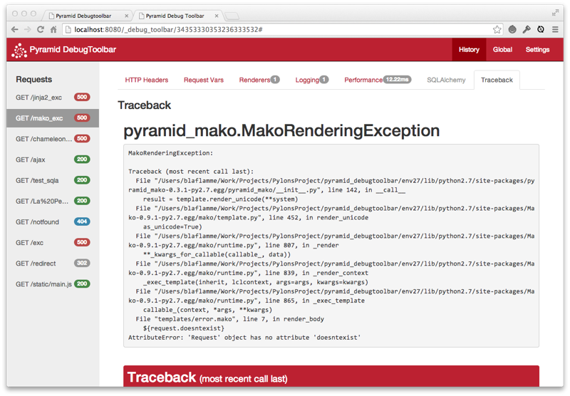

Redirect Handling
-----------------

When a response is returned to Pyramid that has a redirect status code (301,
302, etc.) and the ``debugtoolbar.intercept_redirect`` setting is ``true``,
Pyramid presents an interim page with a link to the target of the redirect.
You can use the toolbar on the redirect source page, then when finished, use
the link to continue to the target page.

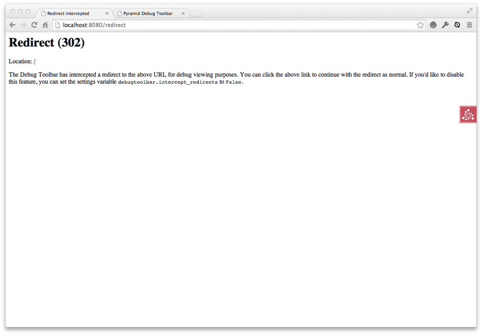

Adding custom panels
--------------------

In some cases it can be desirable to add a custom panel to the toolbar to
display some application specific data. There are two steps for adding such a
panel to an application: writing the panel, and adding it to your application
settings.

Understanding how debugtoolbar works
~~~~~~~~~~~~~~~~~~~~~~~~~~~~~~~~~~~~

Before writing the panel, you should understand how pyramid_debugtoolbar
interacts with your application in its two phase process.

pyramid_debugtoolbar wraps every request within a Pyramid "tween" via
``toolbar_tween_factory``.  This tween allows the toolbar to record data during
the original request (Phase 1) and injects a link to the toolbar interface
into the rendered Pyramid web pages.  The data is displayed during a secondary
request to the toolbar (Phase 2).

Phase 1 - The original request

When pyramid_debugtoolbar is enabled, it can start tracking data on the original
request.  This involves calling the following panel methods in-band with the
original request:

    * :meth:`pyramid_debugtoolbar.panels.DebugPanel.__init__`
    * :meth:`pyramid_debugtoolbar.panels.DebugPanel.wrap_handler`
    * :meth:`pyramid_debugtoolbar.panels.DebugPanel.process_beforerender`
    * :meth:`pyramid_debugtoolbar.panels.DebugPanel.process_response`

These methods are used to store and manipulate a ``self.data`` variable on each
panel during this original request.  Typically ``self.data`` is first generated
on the ``__init__`` method.  It is important to note that the ``request`` and
event variables available to these methods refer to the original request.

Phase 2 - The debugtoolbar request

When the "/_debug_toolbar/{request_id}" is accessed, the history of the original
request_id and its associated panels are accessed.  Variables such as ``data``
that were generated during the original request are made available for further
processing.  The ``data`` variable is injected into the template for display.

The following panel methods are called or accessed on the debugtoolbar request:

    * :attr:`pyramid_debugtoolbar.panels.DebugPanel.name`
    * :attr:`pyramid_debugtoolbar.panels.DebugPanel.template`
    * :attr:`pyramid_debugtoolbar.panels.DebugPanel.user_activate`
    * :attr:`pyramid_debugtoolbar.panels.DebugPanel.is_active`
    * :meth:`pyramid_debugtoolbar.panels.DebugPanel.has_content`
    * :meth:`pyramid_debugtoolbar.panels.DebugPanel.render_content`
    * :meth:`pyramid_debugtoolbar.panels.DebugPanel.render_vars`
    * :meth:`pyramid_debugtoolbar.panels.DebugPanel.title`
    * :meth:`pyramid_debugtoolbar.panels.DebugPanel.nav_title`


Writing the panel
~~~~~~~~~~~~~~~~~

The panel can be created as part of your application or as a standalone
package. The easiest way to write a panel is to subclass from the
:class:`pyramid_debugtoolbar.panels.DebugPanel` class. Here is the code for a
sample panel:

.. code-block:: python

   from pyramid_debugtoolbar.panels import DebugPanel

   _ = lambda x: x

   class SampleDebugPanel(DebugPanel):
       """
       Sample debug panel
       """
       name = 'Sample'
       has_content = True
       template = 'myapp.lib.debugtoolbar_custom.panels:templates/sample.dbtmako'

       def __init__(self, request):
           self.data = { 'request_path' : request.path_info }

       def nav_title(self):
           return _('Sample')

       def title(self):
           return _('Sample')

   def includeme(config):
       config.registry.settings['debugtoolbar.panels'].append(SampleDebugPanel)

After inheriting from the DebugPanel class, you have to define a few methods and
attributes on your panel:

``name``
  Attribute.  String value.  A unique identifier for the name of the panel. This
  **must** be defined by a subclass.

``has_content``
  Attribute.  Boolean value.  Default is ``True``  This attribute determines if
  the tab is enabled or not.  If ``False`` then the panel's tab will be disabled
  and ``.render_content`` will not be invoked. Most subclasses will want to set
  this to ``True`` by default.  An example of this panel's dynamic utility is
  the SQLA panel; if no SqlAlchemy statements were executed in the request, this
  value is set to ``False`` and the tab is simply disabled.

``user_activate``
  Attribute.  Boolean value.  If the client is able to activate/de-activate the
  panel then this should be ``True``.

``is_active``
  Attribute.  Boolean value.  This property will be set by the toolbar,
  indicating the user's  decision to activate or deactivate the panel. If
  ``user_activate`` is ``False`` then ``is_active`` will always be set to
  ``True``.

``template``
  Attribute.  String value.  Must be overridden.  A mako asset specification.
  The default implementation of ``render_content`` in the base class
  (``DebugPanel``) will attempt to render ``template``.  If ``template`` is not
  defined, and ``render_content`` is not overridden, a ``NotImplemented``
  exception will be raised.

``nav_title``
  Method.  Returns a string.  Called to get the title to be used on
  the toolbar's navigation bar for this panel.

``url``
  Method. Returns a string.  Can be overridden to point the panel at any
  arbitrary URL when the tab is clicked.

``title``
  Method.  Returns a string.  Called to get the title to be used on
  the panel's display page.

``__init__``
  Method.  This method should defines a ``data`` attribute, which is used when
  rendering the template.  This is the first (and often most appropriate)
  opportunity to initialize ``data`` with values that can be derived from the
  request object itself.

``render_content``
  Method.  Return a string containing the HTML to be rendered for the panel.  By
  default this will render the template defined by the ``template`` attribute
  with a rendering context defined by the ``data`` attribute combined with the
  ``dict`` returned from ``render_vars``.  The ``request`` here is the active
  request in the toolbar. Not the original request that this panel represents.

``render_vars``
  Method.  Invoked by the default implementation of ``render_content`` as an
  opportunity to enhance the rendering context.  This method is expected to
  return a ``dict`` of values to use when rendering the panel's HTML content.
  This value is usually injected into templates as the rendering context.  This
  is a useful hook for adding any data you need in the templates, which was not
  already added into the panel's.`data`.  The default SQLA panel is a good
  example of this functionality in use.  The ``request`` here is the active
  request in the toolbar. Not the original request that this panel represents.

``wrap_handler``
  Method.  This method is a hook available to the
  panel in order to track the lifecycle of the original request.  A handler
  accepts a request and returns a response; it is essentially the same as a
  Pyramid ``tween``.  This can be used to update the ``data`` dict with values
  that are wanted for rendering.  The main toolbar routine works by wrapping
  each request in a handler (tween).  Before generating a response, the main
  toolbar routine will call the`wrap_handler` method of each panel.  This
  functionality is often used for decorating the handlers with timing or
  performance metrics.

``process_beforerender``
  Method.  Arguments: ``self``, ``event``.  This method is a hook available to
  the panel in order to track the lifecycle of the original request.  The
  debugtoolbar uses a subscriber event (:class:`pyramid.events.BeforeRender`) to
  call the ``process_beforerender`` method of each enabled panel.  This can be
  used to update the ``data`` dict with  values that are wanted for rendering or
  track properties of the rendering events.

``process_response``
  Method.  Arguments: ``self``, ``response``. This method is a hook available
  to the panel in order to track the lifecycle of the original request. The main
  toolbar routine works by wrapping each request in a tween.  The
  ``process_response`` method of each panel is called within the tween, after
  the
  original request has generated a response.

When creating a new panel, some of these methods *must* be subclassed, while
others can rely on the base class.

Once you define the panel it has to be added to the ``debugtoolbar.panels``
setting of the configuration. A good way to do this is to use an ``includeme``
method in the panel's ``__init__.py``.

The source code for the standard debugpanel ``request_vars.py`` is a good
starting point for inspiration.

Configuring an application to use the panel
~~~~~~~~~~~~~~~~~~~~~~~~~~~~~~~~~~~~~~~~~~~

Once your panel is ready, you can simply add its package name to the
``pyramid.includes`` setting on your application configuration file::

  pyramid.includes =
      pyramid_debugtoolbar
      samplepanel

JavaScript and CSS Available to Custom Panels
~~~~~~~~~~~~~~~~~~~~~~~~~~~~~~~~~~~~~~~~~~~~~

:mod:`pyramid_debugtoolbar` automatically loads several Javascript and CSS
libraries that you can take advantage of when writing custom panels.

    * Bootstrap [http://getbootstrap.com/]
    * jQuery [https://jquery.org/]
    * jquery.tablesorter [http://mottie.github.io/tablesorter]

If you wish to enable tablesorting, add the CSS class "pDebugSortable" to the
opening <table> tag.  For example:

    <table class="pDebugSortable table table-striped table-condensed">

Panel and UI Extras
-------------------

The following is a listing of panels and user interface extras for
``pyramid_debugtoolbar`` created by its users. These extras are unofficial and
not supported by the Pylons Project. To add your contribution, please submit a
pull request to update this documentation.

`Page Up <https://github.com/jvanasco/pyramid_debugtoolbar/commit/189479422ed996d022e79bfa1aa4a8f6038b6d62>`_
    For tabs that have content which requires lots of scrolling down or to the
    right, clicking the Page Up icon resets the window to 0,0.

`pyramid_debugtoolbar_ajax <https://github.com/jvanasco/pyramid_debugtoolbar_ajax>`_
    Adds an "AJAX" panel to the ``pyramid_debugtoolbar``. This panel contains
    a button to replay the request in a new window -- allowing you to spawn a
    debugger window for errors encountered on background ajax requests.

`pyramid_debugtoolbar_dogpile <https://github.com/jvanasco/pyramid_debugtoolbar_dogpile>`_
    dogpile caching support for pyramid_debugtoolbar.


More Information
----------------

.. toctree::
   :maxdepth: 1

   api.rst
   changes.rst
   glossary.rst


Development Versions
--------------------

Visit http://github.com/Pylons/pyramid_debugtoolbar to download development or
tagged versions.

Reporting Bugs
--------------
Visit http://github.com/Pylons/pyramid_debugtoolbar/issues to report bugs.

Indices and tables
------------------

* :ref:`glossary`
* :ref:`genindex`
* :ref:`modindex`
* :ref:`search`
