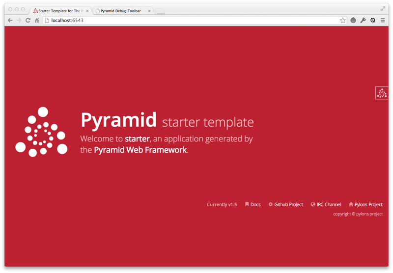
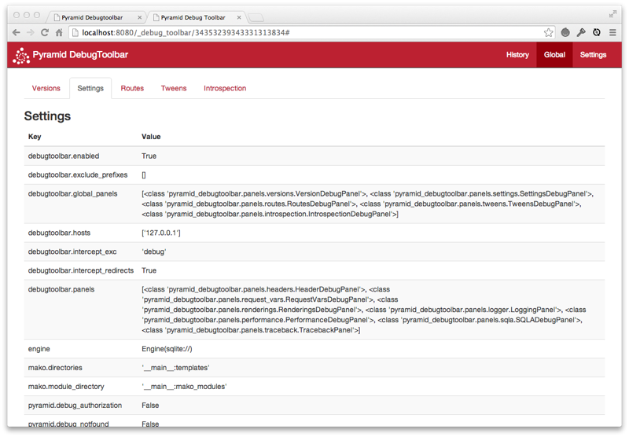
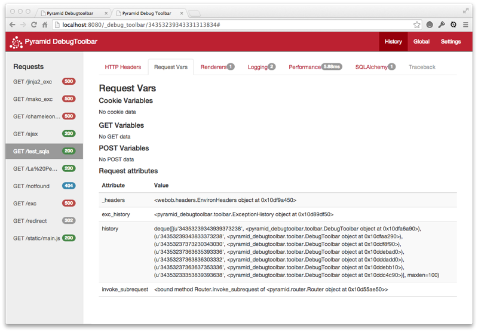
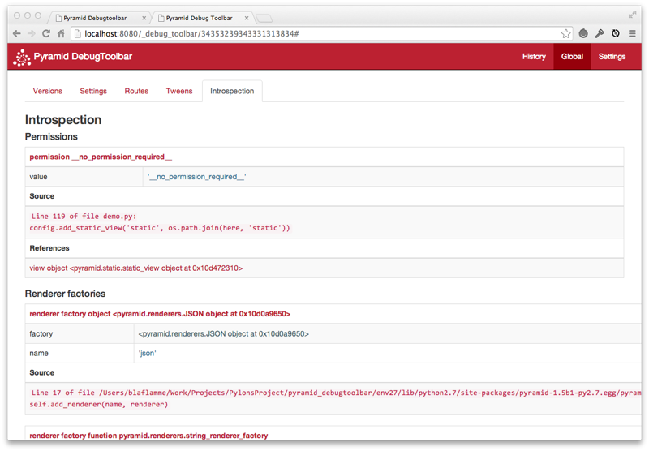

pyramid_debugtoolbar
====================

.. _overview:

Overview
--------

:mod:`pyramid_debugtoolbar` provides a debug toolbar useful while you're
developing a :term:`Pyramid` application.

:mod:`pyramid_debugtoolbar` is a blatant rip-off of Michael van Tellingen's
``flask-debugtoolbar`` (which itself was derived from Rob Hudson's
``django-debugtoolbar``).  It also includes a lightly sanded down version of
the Werkzeug debugger code by Armin Ronacher and team.

.. warning:: This package only works with Pyramid 1.2a1 and better.

Installation
------------

Install using setuptools, e.g. (within a virtualenv)::

  $ easy_install pyramid_debugtoolbar

Setup
-----

Once :mod:`pyramid_debugtoolbar` is installed, you must use the
``config.include`` mechanism to include it into your Pyramid project's
configuration.  In your Pyramid project's ``__init__.py``:

.. code-block:: python

   config = Configurator(.....)
   config.include('pyramid_debugtoolbar')

Alternately, instead of using the Configurator's ``include`` method, you can
activate Pyramid by changing your application's ``.ini`` file, use the
following line:

.. code-block:: ini

   pyramid.includes = pyramid_debugtoolbar

.. warning:: The debug toolbar should never be enabled in a production
   environment or on a machine with its Pyramid HTTP port exposed directly to
   the internet; it allows arbitrary code execution from only semi-trusted
   sources when configured poorly.

Once Pyramid is restarted, whenever an HTML response is generated by your
Pyramid application, it will include the debug toolbar as a floating element
on right hand side of the page.  Additionally, if f the configuration setting
``debugtoolbar.intercept_exc`` is ``debug`` (the default), when an exception
is raised by your application, a "pretty" traceback will be shown with inline
debugging controls that will allow you to evaluate arbitrary Python
expressions within the traceback page.  A URL leading to a debugging page for
each exception raised by your application will additionally be logged to the
console.

.. note:: The HTML returned by your Pyramid application must contain a
   ``</body>`` end-body tag for the toolbar to be injected into a response.

.. note:: The debug toolbar now loads and uses its own modified version of
   RequireJS_ to load its scripts. You no longer need to add it to RequireJS's
   path configuration and ask RequireJS to load it.

.. _RequireJS: http://requirejs.org/

Settings
~~~~~~~~

Settings can be used to control the operation of the toolbar. These settings
are typically specified in the Pyramid "app" section of the Pyramid ``.ini``
file.

``debugtoolbar.hosts``

   If the request's REMOTE_ADDR is not in this list, the toolbar will not be
   displayed and the exception handler will not be active.  Default:
   ['127.0.0.1', '::1'].  Note that each of the values in the list can be a
   hostmask e.g. (``192.168.1.0/24``).

   This should be a list if setup is done in Python or, if defined in a Paste
   ini file, a single-line list of IP addresses/hostmasks separated by
   spaces.  For example::

      debugtoolbar.hosts = 192.168.1.1 192.168.2.0/24

   To enable access from any host, use the hostmask ``0.0.0.0/0``.

``debugtoolbar.enabled``

   ``true`` if the toolbar is enabled; ``false`` if the toolbar is disabled.
   Default: ``true``.  This disables both the exception handler and the
   toolbar overlay.

``debugtoolbar.intercept_exc``

   This setting can have one of three values: ``display``, ``debug`` or
   ``false``.  Default: ``debug``.  If this value is ``display``, the toolbar
   will display a "pretty" traceback page which allows source viewing and
   when an exception happens.  If this value is ``debug``, the "pretty"
   traceback page will be shown, but it will also contain interactive
   debugging controls which allow you to evaluate arbitrary Python
   expressions in the context of a portion of the traceback, which is useful
   when attempting to track down the cause of the exception. If this value is
   ``false``, the "pretty" traceback will be disabled and all exceptions will
   be raised to the caller of the Pyramid application (usually a WSGI
   server).  Default: ``debug``.  This setting differs from
   ``debugtoolbar.enabled``: it only enables or disables the exception
   handler.  Note that, for backwards compatibility purposes, the value
   ``true`` provided to this setting is interpreted as ``debug``.

``debugtoolbar.eval_exc``

   ``true`` if real-time exception debugging is enabled when
   ``intercept_exc`` is true; ``false`` if real-time exception debugging is
   disabled.  Default: ``true``.  This differs from
   ``debugtoolbar.intercept_exc``: it only controls whether the pretty
   exception rendering displays real-time in-browser debugging controls.  The
   real-time in-browser debugging controls allow you to evaluate arbitrary
   Python expresssions in the context of a stack frame via a browser control.

``debugtoolbar.show_on_exc_only``

  Default: ``false``. If set to ``true`` the debugtoolbar will only be injected 
  into the response in case a exception is raised. If the response is 
  processed without exception the returned html code is not changed by the
  debugtoolbar at all. This option allows the developer to use the toolbar for 
  debugging purposes without interfering with successful responses. 
  E.g. the debugtoolbar button on the right might turn out to be a visual issue 
  if the website uses the same area. And especially in large projects the html code
  generated by the toolbar slows down the page rendering significantly.

``debugtoolbar.intercept_redirects``

   ``true`` if the redirection handler is enabled; ``false`` if the handler
   is disabled.  Default: ``false``.  This differs from
   ``debugtoolbar.enabled``: it only enables or disables the redirection
   handler.

``debugtoolbar.panels``

    A list of dotted Python global names to panel classes.  Defaults to a
    list of all panel types known by :mod:`pyramid_debugtoolbar`, as
    documented in :ref:`pyramid_debugtoolbar_api`.  If this is spelled in an
    ``.ini`` file, it should be a space- or newline-separated sequence of
    dotted Python names.  For example::

      debugtoolbar.panels =
          pyramid_debugtoolbar.panels.versions.VersionDebugPanel
          pyramid_debugtoolbar.panels.settings.SettingsDebugPanel
          pyramid_debugtoolbar.panels.headers.HeaderDebugPanel
          pyramid_debugtoolbar.panels.request_vars.RequestVarsDebugPanel
          pyramid_debugtoolbar.panels.renderings.RenderingsDebugPanel
          pyramid_debugtoolbar.panels.logger.LoggingPanel
          pyramid_debugtoolbar.panels.performance.PerformanceDebugPanel
          pyramid_debugtoolbar.panels.routes.RoutesDebugPanel
          pyramid_debugtoolbar.panels.sqla.SQLADebugPanel
          pyramid_debugtoolbar.panels.tweens.TweensDebugPanel
          pyramid_debugtoolbar.panels.introspection.IntrospectionDebugPanel

``debugtoolbar.button_style``

    Any inline css styles you want to apply to the toolbar button. This
    will override the default style (top:30px) set by ``toolbar.css``. If,
    for example, you want the toolbar button to show up at the bottom off the
    screen, just set ``debugtoolbar.button_style`` to 'top:auto;bottom:30px;'.
    If you're browser support the zoom property, you can even control the
    magnification level of the toolbar button (ie. 'zoom:50%').

``debugtoolbar.exclude_prefixes``

    The debug toolbar won't be shown if the PATH_INFO variable starts with any
    of the prefixes listed in this setting.  If configuration is done via an
    .ini file, the prefixes should be separated by carriage returns. For
    example::

      debugtoolbar.exclude_prefixes =
          /manage
          /settings

    If configuration is done via Python, the setting should be a list.  This
    setting was added in debugtoolbar version 1.0.4.

Custom authorization
~~~~~~~~~~~~~~~~~~~~

Since version 1.0.5 ``pyramid_debugtoolbar`` offers custom
authorization mechanism to control toolbar feature on per-request basis.
Using ``config.set_debugtoolbar_request_authorization(callback)`` directive
you can specify own function to control whether toolbar functionality is enabled
or not.

.. note::
  Custom authorization is performed **after** successful IP address check.
  If ``debugtoolbar.hosts`` settings option is used.

.. note::
  Custom authorization does not have effect on ``pyramid_debugtoolbar``
  static route and /_debug_toolbar/static/* contents will still be accessible.

.. code-block:: python

  from pyramid.security import authenticated_userid
  from pyramid.settings import aslist

  def admin_only_debugtoolbar(request):
      """
      Enable toolbar for administrators only.
      Returns True when it should be enabled.
      """
      admins = aslist(request.registry.settings.get('admins', ''))
      userid = authenticated_userid(request)
      toolbar_enabled = userid and userid in admins
      return toolbar_enabled

  config = Configurator(.....)
  config.include('pyramid_debugtoolbar')
  config.set_debugtoolbar_request_authorization(admin_only_debugtoolbar)

The Toolbar
-----------

When you include the toolbar in your application, a floating toolbar logo
will appear over your application's HTML:

If you click on the "Pyramid DT" logo, the toolbar will expand:

.. image:: toolbar-open.png

Toolbar Panels
--------------

These are the default toolbar panels:

Versions
~~~~~~~~

Displays versions of all installed Python software as well as the Python
version and platform itself.

.. image:: versions.png

Settings
~~~~~~~~

Displays Pyramid deployment settings (aka ``registry.settings``).

HTTP Headers
~~~~~~~~~~~~

Displays HTTP request and response headers for the current page.

.. image:: headers.png

Request Vars
~~~~~~~~~~~~

Displays objects attached to the request of the current page and the WSGI
environment.

Renderings
~~~~~~~~~~

Displays the renderings performed by Pyramid for the current page.

.. image:: renderings.png

Logging
~~~~~~~

Displays messages logged by the current page.

.. image:: logging.png

Performance
~~~~~~~~~~~

Displays timing information, and, if enabled, Python profiling information
for the current page.  When the checkbox on the performance panel is green,
the request will be profiled and profiling information will be gathered and
displayed on the panel output.  When it is red, only timing will be done and
no profiling information will be captured.

.. image:: performance.png

Routes
~~~~~~

Displays the routes currently configured in your application.

.. image:: routes.png

Tweens
~~~~~~

Displays the tween chain for your application, and whether they were defined
explicitly or implicitly.

.. image:: tweens.png

SQLAlchemy
~~~~~~~~~~

Displays SQL queries made by SQLAlchemy by the current page along with timing
information.

.. image:: sqla.png

Introspection
~~~~~~~~~~~~~

Displays a rendering of the data available in Pyramid's configuration
introspection system (available in Pyramid 1.3+ only).

Exception Handling
------------------

When an exception is raised and the ``debugtoolbar.intercept_exc`` setting is
``display`` or ``debug``, Pyramid presents a pretty traceback page.  If the
setting value is ``debug``, you will be able to examine locals in each frame
in the traceback and execute code in the context of each frame.  Read the
instructions on the exception page for more information.

.. image:: exc.png

Redirect Handling
-----------------

When a response is returned to Pyramid that has a redirect status code (301,
302, etc) and the ``debugtoolbar.intercept_redirect`` setting is ``true``,
Pyramid presents an interim page with a link to the target of the redirect.
You can use the toolbar on the redirect source page, then when finished, use
the link to continue to the target page.

.. image:: redirect.png

Adding custom panels
--------------------

In some cases it can be desirable to add a custom panel to the toolbar to
display some application specific data. There are two steps for adding such a
panel to an application: writing the panel and adding it to your application
settings.

Writing the panel
~~~~~~~~~~~~~~~~~

The panel can be created as part of your application or as a standalone
package. The easiest way to write a panel is to subclass from the
``pyramid_debugtoolbar.panels.DebugPanel`` class. Here is the code for a
sample panel:

.. code-block:: python

    from pyramid_debugtoolbar.panels import DebugPanel

    _ = lambda x: x

    class SampleDebugPanel(DebugPanel):
        """
        Sample debug panel
        """
        name = 'Sample'
        has_content = True

        def nav_title(self):
            return _('Sample')

        def url(self):
            return ''

        def title(self):
            return _('Sample')

        def content(self):
            vars = {'somelist':['sample value', 'another value']}
            return self.render(
                'samplepanel:templates/sample.mako',
                vars, self.request)

    def includeme(config):
        config.registry.settings['debugtoolbar.panels'].append(SampleDebugPanel)
        if not 'mako.directories' in config.registry.settings:
            config.registry.settings['mako.directories'] = []

After inheriting from the DebugPanel class, you have to define a few methods on
your panel:

``nav_title``

    Returns a function that can be called to get the title to be used on the
    toolbar's navigation bar for this panel.

``url``

    This is not used at the moment, but it has to be provided because the base
    class will raise NotImplemented if it's not there.

``title``

    Returns a function that can be called to get the title to be used on the
    panel's display page.

``content``

    Returns the panel's content for display. It can return an HTML response
    directly, but normally it's better to use a template, like in the example.

Once you define the panel it has to be added to the ``debugtoolbar.panels``
setting of the configuration. A good way to do this is to use an ``includeme``
method in the panel's ``__init__.py``.

Configuring an application to use the panel
~~~~~~~~~~~~~~~~~~~~~~~~~~~~~~~~~~~~~~~~~~~

Once your panel is ready, you can simply add its package name to the
``pyramid.includes`` setting on your application configuration file::

    pyramid.includes = pyramid_debugtoolbar samplepanel

More Information
----------------

.. toctree::
   :maxdepth: 1

   api.rst
   changes.rst
   glossary.rst

Reporting Bugs / Development Versions
-------------------------------------

Visit http://github.com/Pylons/pyramid_debugtoolbar to download development or
tagged versions.

Visit http://github.com/Pylons/pyramid_debugtoolbar/issues to report bugs.

Indices and tables
------------------

* :ref:`glossary`
* :ref:`genindex`
* :ref:`modindex`
* :ref:`search`
