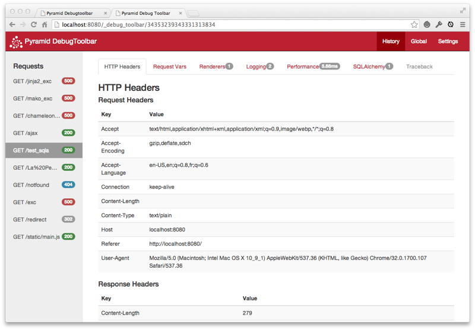

pyramid_debugtoolbar
====================

Overview
--------

``pyramid_debugtoolbar`` provides a debug toolbar useful while you're
developing a :term:`Pyramid` application.

Note that :mod:`pyramid_debugtoolbar` is a blatant rip-off of Michael van
Tellingen's ``flask-debugtoolbar`` (which itself was ripped off from Rob
Hudson's ``django-debugtoolbar``).

.. warning:: This package only works with Pyramid 1.1.1 and above.  As of
   this writing, Pyramid 1.1.1 has not yet been released, which effectively
   means that this package only works with the Pyramid trunk at
   http://github.com/Pylons/pyramid

Installation
------------

Install using setuptools, e.g. (within a virtualenv)::

  $ easy_install pyramid_debugtoolbar

Setup
-----

Once ``pyramid_debugtoolbar`` is installed, you must use the
``config.include`` mechanism to include it into your Pyramid project's
configuration.  In your Pyramid project's ``__init__.py``:

.. code-block:: python
   :linenos:

   config = Configurator(.....)
   config.include('pyramid_debugtoolbar')

From now on, whenever an HTML response is generated by Pyramid, it will
include the debug toolbar as a floating element on right hand side of the
page.  Additionally:

- when an exception is raised by your application, an interactive debugging
  console will appear.

- when a redirect is issued by your application, you will be given the choice
  to examine the state of the redirect page.

.. warning:: The debug toolbar should never be enabled in a production
   environment or on a machine with its Pyramid HTTP port exposed directly to
   the internet; it allows arbitrary code execution from only semi-trusted
   sources when configured poorly.

The Toolbar
-----------

When you include the toolbar in your application, a floating toolbar logo
will appear over your application's HTML:

.. image:: toolbar-closed.png

If you click on the logo, the toolbar will expand:

Toolbar Panels
--------------

These are the default toolbar panels:

Versions
~~~~~~~~

Displays versions of all installed Python software as well as the Python
version and platform itself.

Settings
~~~~~~~~

Displays Pyramid deployment settings (aka ``registry.settings``).

HTTP Headers
~~~~~~~~~~~~

Displays HTTP request and response headers for the current page.

Request Vars
~~~~~~~~~~~~

Displays objects attached to the request of the current page.

Renderings
~~~~~~~~~~

Displays the renderings performed by Pyramid for the current page.

Logging
~~~~~~~

Displays messages logged by the current page.

Performance
~~~~~~~~~~~

Displays timing information, and, if enabled, Python profiling information for the current page.

.. image:: performance.png

Routes
~~~~~~

Displays the routes currently configured in your application.

SQLAlchemy
~~~~~~~~~~

Displays SQL queries made by SQLAlchemy by the current page along with timing
information.

Exceptions
----------

When an exception is raised, Pyramid presents a debugging page:

.. image:: exc.png

You can examine locals in each frame in the traceback.

Settings
--------

Settings can be used to control the operation of the toolbar (usually in the
Pyramid ``.ini`` file within the Pyramid "app" section).

``debugtoolbar.hosts``

   If the request's REMOTE_ADDR is not in this list, the toolbar will not be
   displayed, and the exception handler will not be active.  Default:
   ['127.0.0.1', '::1'].  This should be a list, or if defined in a Paste ini
   file, a linebreak separated list of IP addresses.

``debugtoolbar.enabled``

   ``true`` if the toolbar is enabled; ``false`` if the toolbar is disabled.
   Default: ``true``.  This disables both the exception handler and the
   toolbar overlay.

``debugtoolbar.intercept_exc``

   ``true`` if the exception debugger is enabled; ``false`` if the exception
   debugger is disabled.  Default: ``true``.  This differs from
   ``debugtoolbar.enabled``: it only disables the exception handler.

``debugtoolbar.intercept_redirects``

   ``true`` if the redirection handler is enabled; ``false`` if the 
   handler is disabled.  Default: ``true``.  This differs from
   ``debugtoolbar.enabled``: it only disables the redirection handler.

``debugtoolbar.panels``

    A list of dotted Python global names to panel classes.  Defaults to a
    list of all panel types known by ``pyramid_debugtoolbar``.

More Information
----------------

.. toctree::
   :maxdepth: 1

   api.rst
   glossary.rst

Reporting Bugs / Development Versions
-------------------------------------

Visit http://github.com/Pylons/pyramid_debugtoolbar to download development or
tagged versions.

Visit http://github.com/Pylons/pyramid_debugtoolbar/issues to report bugs.

Indices and tables
------------------

* :ref:`glossary`
* :ref:`genindex`
* :ref:`modindex`
* :ref:`search`
